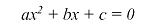

# Корни квадратного уравнения

Python очень активно применяют ученые со всего мира в своих исследованиях.
В этом задании мы с вами попробуем с помощью Python найти корни квадратного уравнения.

Напомним, что квадратное уравнение выглядит следующим образом:



Если вы не помните формулу (а мы и сами ее не помним!), позволяющую найти корни такого уравнения,
обратитесь за помощью к статье в [Википедии](https://ru.wikipedia.org/wiki/%D0%9A%D0%B2%D0%B0%D0%B4%D1%80%D0%B0%D1%82%D0%BD%D0%BE%D0%B5_%D1%83%D1%80%D0%B0%D0%B2%D0%BD%D0%B5%D0%BD%D0%B8%D0%B5).

Ваша задача написать программу, которая запускается в командной строке с параметрами,
вычисляет значения корней квадратного уравнения и выводит их на печать.
На вход программе подаются коэффициенты `a`, `b` и `c`. На печать должно выводиться два корня квадратного уравнения.
Обратите внимание на то, как выводятся корни - каждый с новой строки.

Чтобы не усложнять вашу задачу все коэффициенты, которые мы будем подавать вам на вход являются коэффициентами,
которые в итоге дают 2 корня квадратного уравнения.

Прочитать коэффициенты a,  b,  c вы можете следующим образом:

```python
import sys
a = int(sys.argv[1])
b = int(sys.argv[2])
c = int(sys.argv[3])
```

Примеры работ:

```shell
$ python solution.py 1 -3 -4
4
-1
$ python solution.py 13 236 -396
1
-19
```

Корни должны быть приведены к целочисленному виду перед выводом на экран, порядок вывода корней произвольный.
