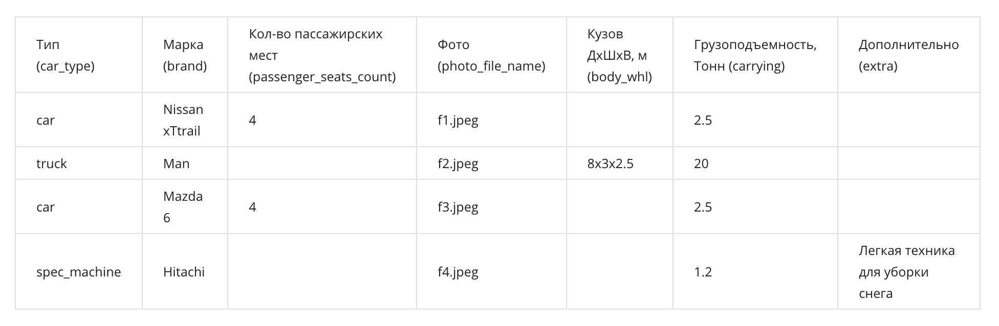
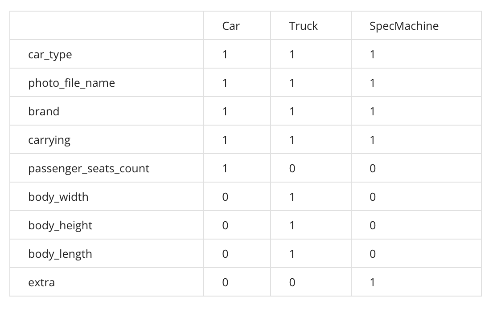

# Классы и наследование

Как правило задачи про классы не носят вычислительный характер. Обычно нужно написать классы,
которые отвечают определенным интерфейсам. Насколько удобны эти интерфейсы и как сильно связаны
классы между собой, определит легкость их использования в будущих программах.

Предположим есть данные о разных автомобилях и спецтехнике. Данные представлены в виде таблицы с
характеристиками. Вся техника разделена на три вида:

- спецтехника
- легковые
- грузовые автомобили

Обратите внимание на то, что некоторые характеристики присущи только определенному виду техники.
Например, у легковых автомобилей есть характеристика «кол-во пассажирских мест»,
а у грузовых автомобилей — габариты кузова: «длина», «ширина» и «высота».



Вам необходимо создать свою иерархию классов для данных, которые описаны в таблице.
Классы должны называться:

- `CarBase` – базовый класс для всех типов машин
- `Car` – легковые автомобили
- `Truck` – грузовые автомобили
- `SpecMachine` – спецтехника

Все объекты имеют обязательные атрибуты:

- `car_type` – значение типа объекта и может принимать одно из значений:
    - `car`
    - `truck`
    - `spec_machine`
- `photo_file_name` – имя файла с изображением машины, допустимы названия файлов изображений с
расширением из списка:
    - `.jpg`
    - `.jpeg`
    - `.png`
    - `.gif`
- `brand` – марка производителя машины
- `carrying` – грузоподъемность

В базовом классе `CarBase` нужно реализовать метод `get_photo_file_ext` для получения расширения
файла изображения. Расширение файла можно получить при помощи `os.path.splitext`.

Для грузового автомобиля необходимо в конструкторе класса определить атрибуты:

- `body_length`
- `body_width`
- `body_height`

отвечающие соответственно за габариты кузова — длину, ширину и высоту.
Габариты передаются в параметре `body_whl` (строка, в которой размеры разделены латинской буквой `x`).
Обратите внимание на то, что характеристики кузова должны быть вещественными числами и характеристики
кузова могут быть не валидными (например, пустая строка). В таком случае всем атрибутам, отвечающим
за габариты кузова, присваивается значение равное нулю.

Также для класса грузового автомобиля необходимо реализовать метод `get_body_volume`, возвращающий
объем кузова.

В классе `Car` должен быть определен атрибут `passenger_seats_count` (количество пассажирских мест),
а в классе `SpecMachine` — `extra` (дополнительное описание машины).

Полная информация о атрибутах классов приведена в таблице ниже, где `1` - означает, что атрибут
обязателен для объекта, `0` - атрибут должен отсутствовать.



Обратите внимание, что у каждого объекта из иерархии должен быть свой набор атрибутов и методов.
Например, у класса легковой автомобиль не должно быть метода `get_body_volume` в отличие от класса
грузового автомобиля. Имена атрибутов и методов должны совпадать с теми, что описаны выше.

Далее вам необходимо реализовать функцию `get_car_list`, на вход которой подается имя файла
в формате `csv`. Файл содержит данные, аналогичные строкам из таблицы. Вам необходимо прочитать
этот файл построчно при помощи модуля стандартной библиотеки `csv`. Затем проанализировать строки
на валидность и создать список объектов с автомобилями и специальной техникой.
Функция должна возвращать список объектов.

Вы можете использовать для отладки работы функции `get_car_list` следующий csv-файл:
`coursera_week3_cars`.

Первая строка в исходном файле — это заголовок `csv`, который содержит имена колонок.
Нужно пропустить первую строку из исходного файла. Обратите внимание на то, что в некоторых строках
исходного файла, данные могут быть заполнены некорректно, например, отсутствовать обязательные поля
или иметь не валидное значение. В таком случае нужно проигнорировать подобные строки и не создавать объекты.
Строки с пустым или не валидным значением для `body_whl` игнорироваться не должны.
Вы можете использовать стандартный механизм обработки исключений в процессе чтения, валидации и создания
объектов из строк csv-файла.

Пример кода, демонстрирующего чтение csv файла:

```python
import csv

with open(csv_filename) as csv_fd:
    reader = csv.reader(csv_fd, delimiter=';')
    next(reader)  # пропускаем заголовок
    for row in reader:
        print(row)
```

Несколько примеров работы:

```python
>>> from solution import *
>>> cars = get_car_list('cars_week3.csv')
>>> len(cars)
4
>>> for car in cars:
...     print(type(car))
... 
<class 'solution.Car'>
<class 'solution.Truck'>
<class 'solution.Truck'>
<class 'solution.Car'>
>>> cars[0].passenger_seats_count
4
>>> cars[1].get_body_volume()
60.0
>>> 
```
