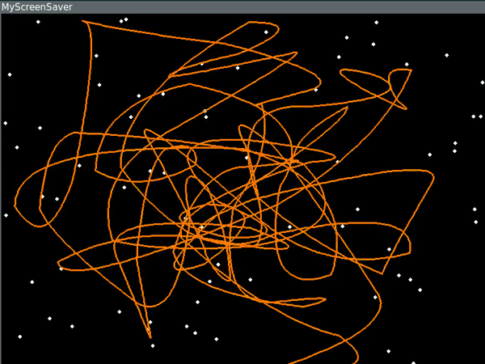

# Создание иерархий классов

В этом задании вам необходимо сделать рефакторинг уже реализованной программы - заставки для скринсейвера.



Для работы программы необходима библиотека [PyGame](https://www.pygame.org/).

Программа запускается из консоли, как обычный Python скрипт:

```shell
$ python3 screen.py
```

В открывшемся окне программы доступны следующие команды управления:

- `<F1>` - показать справку по командам
- `<R>` - рестарт
- `<P>` - пауза, снять/поставить
- `<num->` - увеличить количество точек «сглаживания»
- `<num+>` - уменьшить количество точек «сглаживания»
- `<mouse left>` - добавить «опорную» точку

По умолчанию при старте программы «опорные» точки отсутствуют и программа находится в состоянии паузы (движение кривой выключено).
Для добавления точек сделайте несколько кликов левой клавишей мыши в любом месте окна программы.
Отрисовка кривой произойдет, когда точек на экране станет больше двух. Нажмите клавишу `<P>`, чтобы включить движение кривой.

## Ваша задача

1. Изучить документацию к библиотеке pygame и код программы. Понять механизм работы программы
(как происходит отрисовка кривой, перерасчет точек сглаживания и другие нюансы реализации программы)

2. Провести рефакторниг кода, переписать программу в ООП стиле с использованием классов и наследования.

    - Реализовать класс 2-мерных векторов `Vec2d` [1]. В классе следует определить методы для основных математических операций,
    необходимых для работы с вектором: `Vec2d.__add__` (сумма), `Vec2d.__sub__` (разность), `Vec2d.__mul__` (произведение на число).
    А также добавить возможность вычислять длину вектора с использованием функции `len(a)` и метод `int_pair`,
    который возвращает кортеж из двух целых чисел (текущие координаты вектора).
    - Реализовать класс замкнутых ломаных `Polyline` с методами отвечающими за добавление в ломаную точки `(Vec2d)` c её скоростью,
    пересчёт координат точек `set_points` и отрисовку ломаной `draw_points`. Арифметические действия с векторами должны быть
    реализованы с помощью операторов, а не через вызовы соответствующих методов.
    - Реализовать класс `Knot` (наследник класса `Polyline`), в котором добавление и пересчёт координат инициируют вызов
    функции `get_knot` для расчёта точек кривой по добавляемым «опорным» точкам [2].
    - Все классы должны быть самостоятельными и не использовать внешние функции.
    - Реализовать дополнительный функционал (выполнение требований этого пункта предоставляет возможность потренировать свои
    навыки программирования и позволяет получить дополнительные баллы в этом задании). К дополнительным задачам относятся:
    реализовать возможность удаления «опорной» точки из кривой, реализовать возможность отрисовки на экране нескольких кривых,
    реализовать возможность ускорения/замедления скорости движения кривой(-ых).

## Примечания

- [1] Вектор определяется координатами x, y — точка конца вектора. Начало вектора всегда совпадает с центом координат (0, 0).
- [2] Здесь стоит уточнить, что стоит различать понятия точек, используемых в описании задания. Существуют два вида: «опорные» и «сглаживания».
Первые задают положение углов замкнутой ломаной и служат основой для вычисления вторых. Количество точек «сглаживания» определяет насколько
плавными будут обводы углов ломаной. Вы можете поэкспериментировать с изменением количества точек сглаживания (см. команды программы) и понаблюдать,
как изменяется отрисовка линии при различных значениях (текущее количество точек «сглаживания» можно посмотреть на экране справки).

## Review criteria

Для получения положительной оценки необходимо:

- Реализовать все требуемые классы
- Все классы должны быть самостоятельными и полноценными
- Полученный код должен корректно исполняться и сохранить все возможности предоставленного

Для получения максимальной оценки необходимо реализовать _дополнительные задания_. Вариантов их решения много. Вам необходимо предложить свой.

Реализация окна помощи — на Ваше усмотрение.
